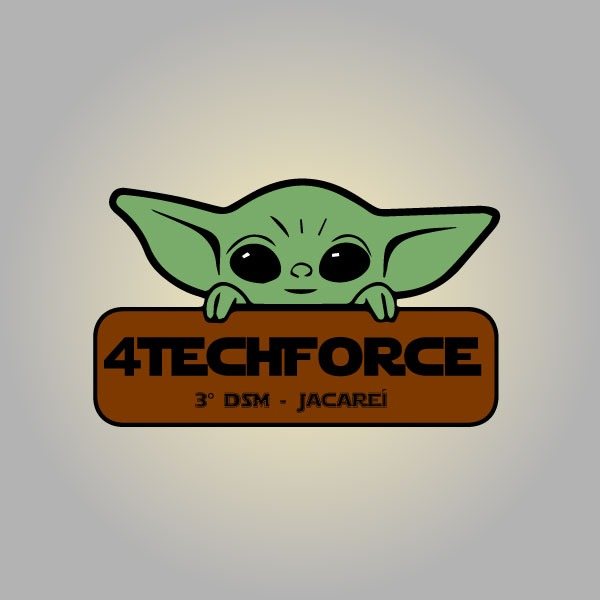
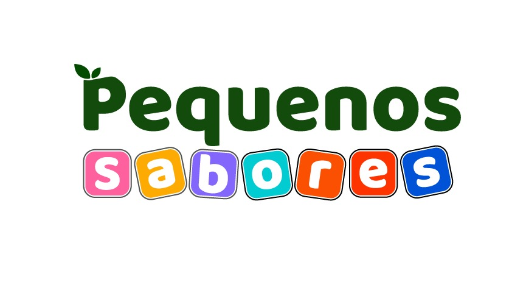
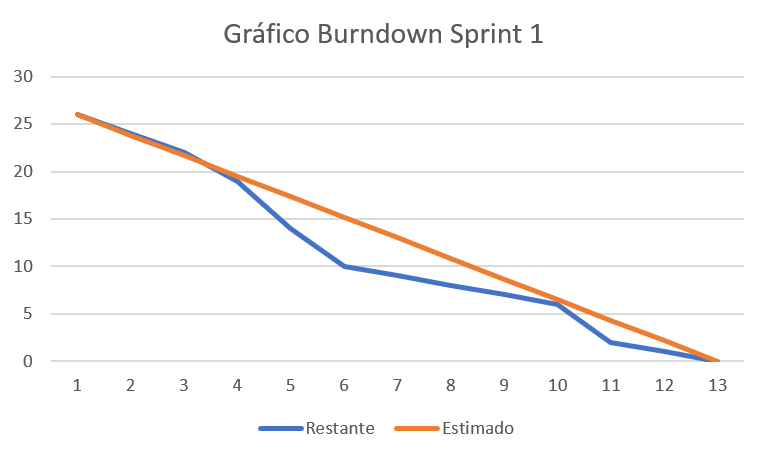

 

  

  

    <a href ="#objetivo">Objetivo </a>|
    <a href="#sobre">Sobre</a> | 
    <a href="#entregas">Entregas</a> | 
    <a href="#backlogs">Backlogs</a> |  
    <a href="#tecnologias">Tecnologias</a> | 
    <a href="#equipe">Equipe</a>

## 📌 Objetivo do projeto
O objetivo é especificar e construir uma aplicação web que permita aos usuários registrar e monitorar a ingestão diária de calorias e nutrientes, auxiliando no controle da alimentação e na manutenção da saúde.

<h2> Sobre o projeto </h2>

  

Nós da 4TechForce propomos a criação de uma aplicação web destinada ao registro e monitoramento da ingestão diária de calorias e nutrientes por crianças. Nossa aplicação se diferencia por ser projetada especificamente para atender às necessidades das crianças e seus responsáveis, oferecendo ferramentas que facilitam o acompanhamento da alimentação de maneira simples e intuitiva. Ao focar nesse público, buscamos contribuir para a saúde infantil e a formação de hábitos alimentares saudáveis desde cedo.

 
 

## 🎯 Entregas

O projeto está sendo realizado utilizando-se da metodologia ágil SCRUM, separadas em 3 entregas.
 

| Sprint | Período | Vídeo | Status |
|:------:|:-------:|:-----:|:------:|
| 01     | 02/09/2024 – 17/09/2024 | <a href="">Vídeo Sprint 1</a> | Entregue :heavy_check_mark: | 
| 02     | 23/09/2024 - 08/10/2024  | <a href="">Vídeo Sprint 2</a> | Em desenvolvimento |    
| 03     | 14/10/2024 - 08/11/2024  | <a href="">Vídeo Sprint 3</a> | Em desenvolvimento | 

<h2 align="center">Backlogs</h2>

<h3 align="center">Backlog do Produto</h3>

| Requisito | Sprint | Prioridade | 
|:---------:|:------:|:----------:|
|   Implementar autenticação de usuário   |  1  |    Alta   |   
|   Implementar registro de ingestão de calorias    |  2  |    Alta    |  
|   Registrar dados de peso, altura, e atividade física    |  2  |    Alta  | 
|   Gerar relatório de acompanhamento de peso    |  3   |    Alta    | 
|   Assegurar compatibilidade entre diferentes dispositivos    |  3  |   Média    | 
|   Manter documentação atualizada no GitHub    |  2   |    Alta    | 
|   Armazenamento e integração com MongoDB e SGBD   |  1   |    Alta    | 
|   Desenvolver back-end em TypeScript e Node.js   |  1  |    Alta    | 
|   Desenvolver front-end em React TypeScript com as telas descritas    |  2   |    Alta    | 
|  Garantir desempenho adequado do sistema   |  2   |    Alta    | 

 

<h3 align="center">User Story</h3>

| **Requisitos**                                            | **User Story** |
|:---------------------------------------------------------:|:--------------:|
| Implementar autenticação de usuário                      | "Como usuário, quero autenticar-me no sistema, para que eu possa acessar minha conta de forma segura e personalizada." |
| Implementar registro de ingestão de calorias              | "Como usuário, quero registrar a ingestão de calorias das minhas refeições, para que eu possa acompanhar e gerenciar minha dieta de maneira eficaz." |
| Registrar dados de peso, altura e atividade física       | "Como usuário, quero registrar meus dados de peso, altura e frequência de atividade física, para que eu possa monitorar meu progresso e ajustar minha dieta e exercícios conforme necessário." |
| Gerar relatório de acompanhamento de peso                | "Como usuário, quero gerar relatórios de acompanhamento do meu peso, para que eu possa visualizar meu progresso ao longo do tempo e fazer ajustes conforme necessário." |
| Assegurar compatibilidade entre diferentes dispositivos  | "Como usuário, quero que o sistema seja compatível com diferentes dispositivos e tamanhos de tela, para que eu possa acessar o sistema de qualquer dispositivo sem problemas de visualização." |
| Manter documentação atualizada no GitHub                 | "Como membro da equipe, quero ter acesso à documentação atualizada no GitHub, para que eu possa acompanhar o progresso do projeto e entender o estado atual do sistema." |
| Armazenamento e integração com MongoDB e SGBD            | "Como desenvolvedor, quero configurar o armazenamento de dados usando MongoDB e integrá-lo ao sistema, para que eu possa garantir a persistência e recuperação adequada dos dados." |
| Desenvolver back-end em TypeScript e Node.js              | "Como desenvolvedor, quero implementar o back-end do sistema utilizando TypeScript e Node.js, para que eu possa garantir que o sistema seja robusto, escalável e mantenha boas práticas de desenvolvimento." |
| Desenvolver front-end em React TypeScript com as telas descritas | "Como usuário, quero ter uma interface de usuário desenvolvida em React TypeScript com as telas especificadas, para que eu possa interagir com o sistema de maneira intuitiva e eficiente." |
| Garantir desempenho adequado do sistema                  | "Como usuário, quero que o sistema funcione de maneira rápida e eficiente, para que eu possa ter uma experiência de uso sem lentidão ou interrupções." |

 
<h3 align="center">Backlog das Sprints</h3>

<h3 align="center">Sprint 1</h3>

| Item | Funcionalidade |
|:----:|:--------------:|
|  1   | Protótipo  |
|  2   | Tela de Login  |
|  3   | Cadastro do usuário |

<h3 align="center">Tarefas na Sprint</h3>

| Tarefas              | Story Point |
|:--------------------:|:-----------:|
| Criação das telas no figma com o design a ser utilizado pelo o website  |      13       |
| Tela de Login e Cadastro para a apresentação|      2       |
| Configuração do banco de dados |      8      |
| Operações CRUD, autenticação de rotas e login   |      1       |
| Criação do vídeo para apresentação |      2      |
| **Total Story Point** |       26      |

 
 

## Métrica do Time

 
 

## 🚀 Tecnologias Utilizadas

 
 

<h3 align="center">Equipe</h3>

|    Função   |  Nome    |    GitHub     |
| :----------: | :-----------------------|:------------------------------------------: |
|   Product Owner| Ligia Ribeiro de Almeida |[Github](https://github.com/ligribeiro)|
|   Scrum Master| Marcelly Cristini Santos de Souza |[GitHub](https://github.com/Marcelly-cris)|
|   Dev Team| Jackson Rodrigo Costa Machado |[GitHub](https://github.com/jacksonrcmachado)|
|   Dev Team| Ana Júlia Tette Lopes Afonso |[GitHub](https://github.com/AnaBarbancho)|

 

